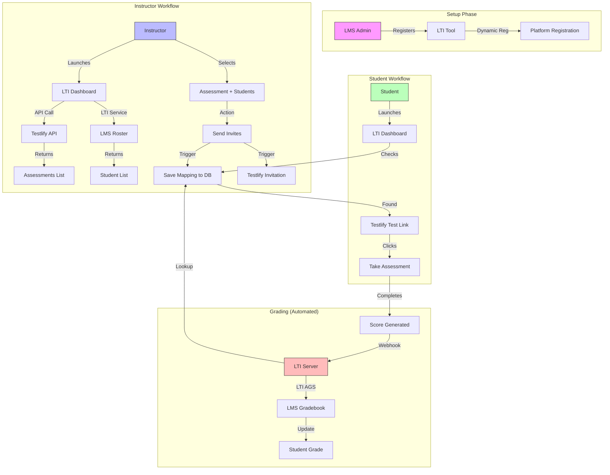
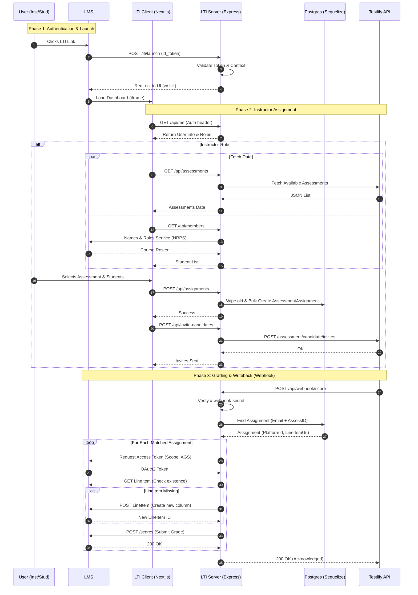

# Product Flow Diagrams

## 1. High-Level User Journey

The following flowchart outlines the major steps for Instructors, Students, and the System, covering Setup, Assignment Creation, and Grading.

## 2. Technical Sequence Diagram

This diagram visualizes exactly how the code (Controllers & APIs) executes these flows, detailing the interaction between the Client, Server, Database, LMS, and Testlify.

## Key Components

- **LTI Server (`server.ts`, `index.ts`)**: Handles the handshake and `onConnect`.
- **API Controller (`apiController.ts`)**: Bridges the frontend with Testlify and the LMS (NRPS).
- **Webhook Controller (`webhookController.ts`)**: The critical piece for grade passback. It blindly accepts scores from Testlify and maps them back to the LMS user via the `AssessmentAssignment` database table.
- **Database (`AssessmentAssignment` model)**: Acts as the "Glue" holding the state between the LTI Context (Course), the LMS User, and the Testlify Assessment ID.
